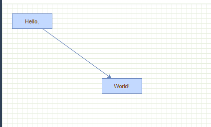

# mxGraph
[文档地址](https://jgraph.github.io/mxgraph/)

## HelloWorld
#### 项目初体验， 安装依赖
```shell
npm install mxgraph --save
```
#### `mxgraph` 初始化
```javascript
// mxgraph.js
import mx from 'mxgraph'

export default mx({
  mxBasePath: './assets/mxgraph',
})
```

mx 方法传入的配置项 mxBasePath 指向的路径一定要是一个可以通过 url 访问的静态资源目录
可以相对地址也可以是绝对地址， 但是这里填入的相对地址是相对于 src 下的， 绝对地址是 public 下的

#### 使用
使用的时候只需要将插件导入后再获取对应的方法或类进行进行使用

```javascript
import mxgraph from '@/utils/mxgraph'
const {
  mxClient, mxUtils, mxEvent,
  mxGraph, mxRubberband
} = mxgraph
```

#### 判断浏览器兼容
// 使用之前要确定当前浏览器是否兼容
```javascript
if (!mxClient.isBrowserSupported()) {
  mxUtils.error('Browser is not supported!', 200, false)
}
```

#### 容器
首先需要准备一个 Dom 容器， vue 项目中是比较方便获取 Dom，
首先需要在容器标签上定义一个 ref 属性
* 如果是 HTML 原生标签可以直接获取到 Dom 对象
* 如果是组件标签需要额外获取
```vue
<template>
  <div>
    <div ref="GraphDom"></div>
    <graph-container ref="GraphContainer"></graph-container>
  </div>
</template>

<script>
export default {
  getDom() {
    // 原生标签直接获取
    const div = this.$refs.GraphDom
    // 组件标签需要获取 $el 属性
    const container = this.$refs.GraphContainer.$el
  }
}
</script>
```

#### 初始化 mxgraph

```javascript
// 禁用图层右键菜单
mxEvent.disableContextMenu(container)
// 在给定的容器内创建图形
const graph = new mxGraph(container)
```

#### insertVertex
insertVertex 用于创建图形
* parent为画板父层
* id 为非必传参数， 如果不传系统会自动添加一个
* value 图形属性， 可以是字符串也可以为对象， 是该图形附带信息
* x，y为坐标起点， width宽，height高
* style为图形样式 例如： 'fontColor=#ccc;fontSize=12;align=left;'
* relative相对位置
```javascript
mxGraph.prototype.insertVertex = function(parent,id,value,x,y,width,height,style,relative) {}
```

#### insertEdge
insertEdge 用于创建连线
参数与 insertVertex 方法类似， 不同的是 source为起点，target为连线结束
```javascript
mxGraph.prototype.insertEdge = function(parent,id,value,source,target,style) {}
```

#### Cell
以上两个方法都是创建了一个 Cell 对象实例， mxCell 这个类封装了 Cell 的操作

#### 绘制
```javascript
const parent = graph.getDefaultParent()
graph.getModel().beginUpdate()
try {
  const v1 = graph.insertVertex(parent, null, 'Hello,', 20, 20, 80, 30)
  const v2 = graph.insertVertex(parent, null, 'World!', 200, 150, 80, 30)
  const e1 = graph.insertEdge(parent, null, '', v1, v2)
} finally {
  graph.getModel().endUpdate()
}
```
#### 最终显示



## Anchors
